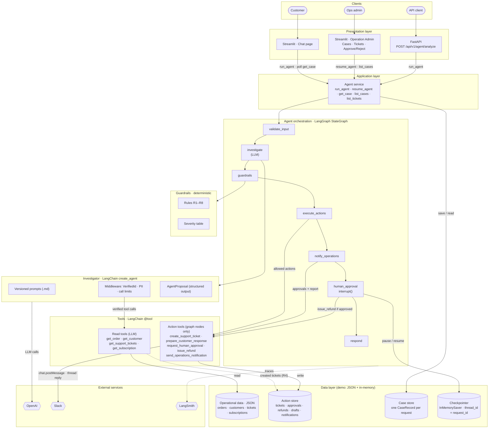

# OpsPilot: AI Operations Automation Agent

OpsPilot helps a customer-support / operations team handle incoming requests for a (fictional) direct-to-consumer e-commerce company. Customers describe their problem to a **chatbot**; OpsPilot investigates internal operational data with tools, explains the issue with evidence, runs safe internal actions automatically, **reports every case to the operations team in Slack**, and **stops for a human** before anything risky. Every refund waits for approval on the **Operation Admin** page.

> **The core idea:** the LLM *investigates and recommends*; deterministic code *decides*; a human *approves* money.

---

## 1. Problem

### Business context

**The company:** a fictional **DTC** (direct-to-consumer) e-commerce business that sells directly to consumers through its own website and also offers **subscription** plans (recurring orders).

**The users:** the **Customer Support and Operations** team. Every day they receive a large volume of customer requests:

- Delayed or missing orders
- Cancelled orders, address changes
- Refund requests
- Subscription problems (failed payments, paused plans…)

### The business problem

Today, for every request, an agent does everything by hand:

1. Read the message and work out what the customer wants
2. Open several systems to look things up: orders, customers, past tickets, subscriptions
3. Judge how serious the issue is (each person judges differently)
4. Check whether a ticket already exists, to avoid duplicates
5. Decide what to do next: create a ticket, alert the operations team, issue a refund…
6. Write a reply to the customer

This is **slow, repetitive, and inconsistent**. But handing the whole job to an AI is **dangerous**. An AI can:

- **invent data**, for example say an order is on its way when the order does not exist;
- **issue a refund on its own**, causing direct financial loss;
- **send the wrong message to a customer**, for example promise a refund nobody approved.

## 2. Solution

OpsPilot works like **a new team member preparing a case file for their manager**. It does all the research and analysis, handles the small safe tasks itself, and **escalates anything involving money to someone with the authority to decide**.

### A worked example (Scenario 2)

> Customer: *"My order ORD-1007 is 15 days late. I want a refund."*

| Step | What OpsPilot does |
|---|---|
| 1. Understand the request | The customer reports a late delivery and wants a refund |
| 2. Look things up | Order ORD-1007 belongs to Alex Johnson, $249.99, expected on Sep 25, not delivered; no existing ticket |
| 3. Evidence | "The order is delayed and is 15 days past its expected delivery date". Computed from the data, not taken from the customer's claim |
| 4. Severity | **HIGH**: the customer wants a refund, and the order is more than 7 days late |
| 5. Act right away | Create a support ticket, alert the operations team, draft a reply to the customer |
| 6. Stop and ask for approval | **Refund of $249.99 → waits for a manager's approval** |
| 7. Reply to the customer | The chatbot answers: "Hi Alex, … your refund request is being reviewed by our team…". It never promises a refund. |
| 8. Report to the team | The full analysis is posted to the operations Slack channel, tagging the people on duty |

Only when a manager clicks **Approve** on the Operation Admin page does the system issue the (simulated) refund; the decision is also posted in the Slack thread, and the chatbot tells the customer the outcome (with the refund reference). Clicking **Reject** issues no refund; the customer is told a team member will follow up.

### Business rules

| Rule | What it means for the business |
|---|---|
| Only refunds need human approval | People stay accountable for every decision involving money, whatever the amount |
| Safe customer replies | The chatbot replies like a person, but every reply is checked by a content policy: it can never promise a refund or compensation, or reveal internal details |
| Report every case to the team | The full analysis goes to the operations Slack channel and tags the responsible people, so nothing is handled silently |
| No duplicate tickets | If an open ticket already exists, the operations team is pointed to it, so two people don't work on the same case |
| Missing information → ask | Without an order ID, the AI asks the customer in its own words instead of guessing; when the customer replies, it continues with the full context |
| Never invent data | If an order does not exist, the system says "not found". The AI may not look up an order ID the customer never wrote |
| High-value orders ($500+) | Tickets and alerts are marked `critical` and severity is CRITICAL, so the operations team is alerted immediately |
| Severity is decided by rules | The AI only understands what the customer wants; LOW / MEDIUM / HIGH / CRITICAL is computed by code from the data, so it is consistent across cases |

The guiding principle of the spec: **"When uncertain, do less rather than more."**

### Who benefits

- **Support agents** no longer open several systems; they get a ready case file with a summary, evidence, and a reply draft.
- **Operations leads** are alerted to serious cases right away and only approve what truly needs a human (refunds).
- **Customers** get faster, more consistent responses.
- **The company** controls financial risk, and every decision is logged and traced in LangSmith for audit.

### How the work is split

OpsPilot splits the work by what each part is good at:

| Step | Who | What |
|---|---|---|
| Understand + investigate | **LLM** (OpenAI via LangChain `create_agent`) | Classifies the request, calls **read-only** tools, writes a summary, evidence, recommended actions, and a reply draft |
| Decide | **Deterministic rules** (`src/guardrails`) | Re-read the data and compute severity. For every recommended action they decide **automatic / human approval / blocked**. |
| Act | **Workflow code** | Runs only the actions the rules allowed: simulated ticket, reply draft, and the case report to **Slack** |
| Approve | **Human** | Approves or rejects refunds on the **Operation Admin** page; the workflow pauses until they decide |

If information is missing, OpsPilot asks for it. If a record does not exist, it says so. If the LLM output is invalid, nothing happens. *When uncertain, do less rather than more.*

## 3. Architecture

### System architecture

The whole system, from the people using it down to where data lives. An editable version of this diagram is in [`docs/architecture.drawio`](docs/architecture.drawio) (open it at [app.diagrams.net](https://app.diagrams.net)).



**Components** (left: what the demo uses; right: what it would become in production, see §8):

| Layer | Component | Demo implementation | Production equivalent |
|---|---|---|---|
| Clients | Customer, ops admin, API client | Browser / HTTP | Same, behind auth |
| Presentation | Chat page | Streamlit `views/chat.py`; polls the case every 3 s while a refund is pending | Web/mobile chat widget, push updates (websocket) |
| Presentation | Operation Admin page | Streamlit `views/admin.py`: Cases tab (reports, Approve/Reject), Tickets tab | Internal back-office app with RBAC |
| Presentation | REST API | FastAPI `src/api/`: `POST /api/v1/agent/analyze`, `GET /healthz` | Same, plus a resume endpoint, auth, rate limits |
| Application | Agent service | `src/agents/service.py`: the only entry point for UI and API | Same; stateless workers behind a queue |
| Orchestration | Agent pipeline | LangGraph `StateGraph`, 7 nodes (see below) | Same |
| Orchestration | Human-in-the-loop | `interrupt()` + `Command(resume=...)` | Same, with a durable approval queue |
| Agent | Investigator | `create_agent` + `init_chat_model("openai:…")`, read tools only, `AgentProposal` via `ToolStrategy` | Same, gated by LangSmith evals |
| Agent | Prompts | Versioned Markdown in `src/prompts/` | Same, or LangSmith prompt hub |
| Guardrails | Layer 1 | LangChain middleware: `VerifiedIdMiddleware`, `PIIMiddleware`, call limits | Same |
| Guardrails | Layer 2 | Pure functions: severity table, rules R1–R8 | Same, rules loaded from config |
| Tools | Read tools | Query the data layer | Call the order / CRM / ticketing / billing APIs |
| Tools | Action tools | Simulated, recorded in the action store; Slack is real | Ticketing (Zendesk/Jira), payments (Stripe) with idempotency keys |
| Data | Operational data | JSON files in `data/` (read-only) | Order DB, CRM, ticketing system |
| Data | Action store | In-memory (`repositories/action_store.py`) | Postgres tables + audit log |
| Data | Case store | In-memory (`repositories/case_store.py`) | Postgres |
| Data | Checkpointer | LangGraph `InMemorySaver` (`memory/checkpointer.py`) | LangGraph `PostgresSaver` |
| External | LLM | OpenAI (`OPENAI_MODEL`, e.g. `gpt-4.1-mini`) | Same, with a fallback model |
| External | Notifications | Slack bot (`chat.postMessage`); simulated when `SLACK_*` is unset | Same |
| External | Observability | LangSmith traces + `key=value` logs | LangSmith + log aggregation and alerts |

**Main flows:**

1. **Customer request.** Chat (or the API) → `run_agent` → the pipeline runs once → the reply is shown in the chat and the case is saved in the case store.
2. **Investigation.** `investigate` calls OpenAI; the model may only call the 4 read tools, and middleware blocks any ID the customer never wrote. Output: an `AgentProposal`.
3. **Decision.** `guardrails` re-reads the data and decides per action: automatic, human approval, or blocked. No LLM is involved.
4. **Actions.** `execute_actions` creates the ticket and the reply draft; `notify_operations` creates refund approvals and posts the full report to Slack, tagging the team.
5. **Approval.** `human_approval` pauses (`interrupt()`); the state is kept in the checkpointer. In Operation Admin, Approve/Reject → `resume_agent` → `issue_refund` (if approved) → a Slack thread reply → the chat tells the customer the outcome.
6. **Observability.** Every run is traced in LangSmith with `request_id` and prompt versions.

### Agent pipeline (inside the orchestration layer)


Purple: the only LLM step. Green: deterministic code. Orange: human-in-the-loop. Dashed edges are the conditional early exits to `respond`. Source: [`docs/langgraph-flow.mmd`](docs/langgraph-flow.mmd); the structure matches `build_graph(...).get_graph()`.

<details>
<summary>Text version (with middleware, tools, and per-node details)</summary>

```text
                        ┌──────────────────────┐
                        │   Customer request   │  Chat page (Streamlit) · REST API
                        └──────────┬───────────┘
                                   ▼
                        ┌──────────────────────┐
                        │    validate_input    │  deterministic: length, ID extraction
                        └──────────┬───────────┘
                                   ▼
 ┌─────────────────────────────────────────────────────────────────────┐
 │ investigate: LangChain create_agent (the ONLY LLM step)             │
 │   tools: get_order · get_customer · get_support_tickets ·           │
 │          get_subscription (read-only)                               │
 │   middleware (guardrail layer 1): VerifiedIdMiddleware (no guessed  │
 │     IDs) · PIIMiddleware (emails redacted) · model/tool call limits │
 │   output: AgentProposal (Pydantic, via ToolStrategy)                │
 └──────────────────────────────────┬──────────────────────────────────┘
                                   ▼
                        ┌──────────────────────┐
                        │      guardrails      │  deterministic (layer 2): re-reads data,
                        │  severity + R1–R8    │  automatic / human_approval / blocked
                        └──────┬───────────┬───┘
               stop rules      │           │ proceed
     (missing info, not found, │           ▼
      unverified ID)           │  ┌──────────────────────┐
                               │  │   execute_actions    │  ticket · reply draft (R8-checked)
                               │  └──────────┬───────────┘
                               │             ▼
                               │  ┌──────────────────────┐
                               │  │  notify_operations   │  approval requests + full report → Slack
                               │  └──────────┬───────────┘  (tags the ops team; simulated if unset)
                               │             ▼
                               │  ┌──────────────────────┐
                               │  │    human_approval    │  interrupt(): pauses for refunds, resumes on
                               │  └──────────┬───────────┘  Approve / Reject in Operation Admin → Slack thread
                               ▼             ▼
                        ┌──────────────────────┐
                        │       respond        │  structured AnalyzeResponse
                        └──────────────────────┘
```

</details>

The outer pipeline is an explicit LangGraph `StateGraph`. Pausing for approval uses LangGraph `interrupt()` with a checkpointer; `Command(resume=...)` continues the run after the decision. Every run is traced in **LangSmith** (`run_name="opspilot"`, metadata `request_id` + `prompt_versions`), and every decision is logged as a `key=value` event.

### Where things live

| Path | Responsibility |
|---|---|
| `src/agents/` | `graph.py` (pipeline), `nodes.py` (node logic), `investigator.py` (`create_agent`), `service.py` (`run_agent` / `resume_agent`), `responder.py` |
| `src/guardrails/` | `rules.py` (R1–R7), `severity.py`, `draft_policy.py` (R8): **pure functions, no LLM**. `middleware.py`: investigation-time guardrails |
| `src/tools/` | LangChain `@tool`s: 4 read tools for the LLM; action tools called only by workflow nodes |
| `src/prompts/` | Versioned Markdown prompts (`ops_agent_system.md`, `customer_response_example.md`) + loader |
| `src/common/schemas/` | Pydantic models and enums shared across layers (`AgentProposal`, `GuardrailDecision`, `AnalyzeResponse`, …) |
| `src/repositories/` | Read-only JSON data store + in-memory action store (tickets, approvals, refunds) + case store (admin page) |
| `src/memory/` | LangGraph checkpointer (agent memory for pause/resume) |
| `src/web/` | Streamlit app: **Chat** page (customers) and **Operation Admin** page (cases + refund approvals, and a **Tickets** tab listing sample tickets plus the simulated tickets created in this session) |
| `src/integrations/` | Slack notifier (`chat.postMessage`, thread replies) and Block Kit report rendering |
| `src/api/` | FastAPI endpoint: a thin adapter over `service.py` |
| `data/` | Fictional sample data: 15 orders, 12 customers, 8 tickets, 10 subscriptions |
| `specs/`, `plans/` | Specification and the phase-by-phase implementation plan |
| `docs/` | `architecture.drawio` (editable system diagram), `langgraph-flow.png` / `system-architecture.png` (rendered diagrams, `.mmd` sources alongside), `demo-script.md` (Loom script), `business-overview.md` (Vietnamese) |

## 4. Key Design Decisions

**LLM reasoning is separated from deterministic rules.** Only the `investigate` node calls the LLM. Severity, approval, duplicate detection, and execution are pure functions in `src/guardrails/`, with their own tests and their own span in LangSmith. `AgentProposal` deliberately has **no** severity, risk, or approval fields, so the model cannot even express such a decision. A test parses imports with `ast` to guarantee `src/guardrails` never imports LangChain models or `src.llm`.

**The LLM can only read.** `create_agent` gets the 4 read tools only. Ticket creation, notifications, approvals, and refunds are called by workflow nodes, and only for actions the guardrails allowed. Malformed LLM output yields no proposal, and the run ends with a safe error and no action.

**Guardrails run in two layers** (spec §12.7):

1. *Inside the agent loop*, LangChain middleware: `VerifiedIdMiddleware` stops a tool call for any ID the customer never wrote (and no tool returned), so a guessed order is never fetched. `PIIMiddleware` keeps customer emails away from the model. Call limits bound the loop.
2. *After the investigation*, the `guardrails` node re-reads the facts from the data (never the LLM's narrative) and applies the business rules:

| Rule | Effect |
|---|---|
| R1 `refund_requires_approval` | Every refund waits for a human, any amount |
| R2 `high_value_order` (≥ $500) | Escalates ticket priority / alert to `critical` and severity to CRITICAL |
| R3 `external_communication_blocked` | No separate customer-messaging action exists; the only customer-facing text is the R8-checked draft shown in the chat (D6) |
| R4 `duplicate_ticket` | An open/in-progress ticket for the same issue blocks a new one |
| R5 `missing_information` | No order/customer ID: ask (the LLM writes the question); every action blocked |
| R6 `order_not_found` | Unknown ID: say so; every action blocked |
| R7 `unverified_id` | The proposal names an ID nobody wrote: treated as a hallucination, every action blocked |
| R8 `customer_draft_policy` | A reply draft promising a refund/compensation or leaking internal details is replaced by a safe fallback |

Business rules are deliberately **not** middleware: the LLM never calls action tools, so there is nothing to intercept, and `HumanInTheLoopMiddleware` cannot express data-dependent rules such as "orders of $500 or more".

**Human approval via `interrupt()`.** The `human_approval` node creates an idempotent approval request and pauses the graph. The run resumes with the reviewer's decision; a missing decision counts as a rejection. `issue_refund` itself refuses unless the approval is approved, as defense in depth.

**Prompts are versioned Markdown.** Every instruction lives in `src/prompts/*.md` with YAML frontmatter. The customer-reply example is a separate file injected into the system prompt, so the reply style can change without touching agent instructions. Prompt versions are attached to every LangSmith trace.

**Tools never fabricate data.** Tools return structured results (`{"success": false, "error": "ORDER_NOT_FOUND", ...}`), and the prompt forbids stating facts that are not in tool results. Delays are computed from the data (`days_late`), not from the customer's claim.

**Customer-facing text is constrained.** The only text a customer sees is the reply draft after the deterministic R8 policy (no refund/compensation promises, no internal details); a violating draft is replaced by a safe fallback. The only other customer message is the fixed-template decision notice after a human approves or rejects a refund (D10). There is no other customer-messaging capability (D6 changed the original "draft only, never shown" behaviour at the client's request).

### Decisions on points the spec left open

| ID | Decision |
|---|---|
| D1 | Scenario 3 uses ORD-1008 (open ticket TCK-2001), so it does not conflict with Scenario 2's ORD-1007. A fixed `REFERENCE_DATE=2026-10-10` makes delays deterministic (ORD-1007 is exactly 15 days late). |
| D2 | **Only refunds need approval.** Rule 2 (orders of $500 or more) escalates priority and severity instead of adding approvals; internal actions stay automatic so the team is alerted at once. Customer messaging does not exist. |
| D3 | Severity is a deterministic table; when several conditions match, the highest wins. Severity drives display and priority, not approval. |
| D4 | The LLM writes the reply draft from an example template (`customer_response_example.md`); deterministic policy R8 checks it before use. |
| D5 | A request without an ID still reaches the LLM, which asks for the missing information in its own words; code guarantees no tool or action runs. Follow-up replies are sent with the earlier messages as `history`. |
| D6 | **Customer chatbot** (client request): the chat shows the R8-checked reply draft to the customer. This deliberately changes spec Rule 3 ("never send automatically"); refund/compensation promises remain impossible because of R8. |
| D7 | **Real Slack notifications** (client request): the full case report is posted to a Slack channel and tags the configured people. It is optional: without configuration it is simulated, so tests and fresh clones never need Slack. |
| D8 | **Operation Admin page**: approvals moved off the customer UI. Admins see every case and approve/reject refunds there; each decision is replied in the report's Slack thread. |
| D9 | Slack is notified only when guardrails allow `send_operations_notification` (stop rules such as missing information or not found send nothing). |
| D10 | **The customer is told the decision** (client request): after an admin approves or rejects a refund, the chat posts the outcome. The message is a deterministic template (`src/agents/customer_updates.py`), not LLM text, because it states a financial outcome: exact amount and refund reference, and it never claims a refund was processed unless `issue_refund` succeeded. The Chat page polls the case every 3 seconds while a refund is pending. |

Also: the spec suggests logging `user_input`. OpsPilot logs the message **length** and the IDs instead of the raw text, to keep customer text and PII out of application logs. The full text is visible in LangSmith when debugging.

## 5. How to Run

Requirements: [uv](https://docs.astral.sh/uv/) (it installs Python 3.14 from `.python-version`), an OpenAI API key, and optionally a LangSmith API key.

```bash
uv sync
cp src/.env/.env.example src/.env/.env      # then set OPENAI_API_KEY, OPENAI_MODEL (e.g. gpt-4.1-mini), LANGSMITH_*, SLACK_* (optional)

uv run python -m streamlit run src/web/app.py     # demo UI → http://localhost:8501 (Chat + Operation Admin)
uv run uvicorn src.main:app --reload              # REST API → http://localhost:8000/docs
uv run pytest                                     # tests (offline: no OpenAI or LangSmith calls)
```

Run commands from the repository root. Use `python -m streamlit`, which puts the repo root on `sys.path` so that `import src…` works. `src/.env` is a directory; the real secrets file `src/.env/.env` is gitignored.

**Slack (optional).** Create a Slack app at api.slack.com/apps with the bot scope `chat:write`, install it to the workspace, invite the bot to a channel (`/invite @OpsPilot`), and set:

```text
SLACK_BOT_TOKEN=xoxb-...
SLACK_CHANNEL_ID=C0XXXXXXX
SLACK_MENTION_USER_IDS=U0XXXXXXX,U0YYYYYYY   # people tagged on every report
```

Without these, reports are logged as `[SIMULATED SLACK]` messages.

API example:

```bash
curl -X POST localhost:8000/api/v1/agent/analyze -H 'Content-Type: application/json' \
  -d '{"message": "Please check order ORD-9999."}'
# → {"status": "not_found", "message": "I couldn't find order ORD-9999 in the available operations data.", ...}
```

Quality checks: `uv run ruff format --check . && uv run ruff check . && uv run mypy && uv run pytest`.

## 6. Demo Examples

Use the scenario buttons on the **Chat** page, then open **Operation Admin** to review cases and decide refunds. The **Tickets** tab shows every ticket; the ones the agent created in this session are marked 🆕. Sending Scenario 1 twice shows duplicate detection on a ticket the agent itself just created. With Slack configured, each report appears in the channel with the configured people tagged. "Today" is fixed at 2026-10-10.

| # | Input | Expected outcome |
|---|---|---|
| 1 | My order ORD-1001 is two days late. Can you check what is happening? | `completed`, **MEDIUM**: ticket + ops alert + draft run automatically; no high-risk action |
| 2 | My order ORD-1007 is 15 days late. I want a refund. | `awaiting_approval`, **HIGH**: ticket, alert, and draft run; **refund waits for Approve/Reject** |
| 3 | Please help with my delayed order ORD-1008. | Ticket **blocked**: "An existing support ticket already exists. Ticket: TCK-2001, Status: open"; ops follow-up alert sent |
| 4 | Please check order ORD-9999. | `not_found`, no invented data, no actions |
| 5 | My order hasn't arrived and I want a refund. | `needs_more_info`: the agent asks for the order ID; no tool or action runs |
| 5b | Reply "It's ORD-1007." to Scenario 5 | Continues with full context → refund waits for approval |
| 6 | My order ORD-1015 is delayed. Please refund the order. | `awaiting_approval`, **CRITICAL** ($1,200): refund needs approval; ticket/alert get `critical` priority |

All of these were verified end to end with `gpt-4.1-mini`, including Approve → simulated refund executed. In Phase 9 they were re-run through the Chat page with a real Slack workspace: S2 and S3 posted tagged reports, S4 and S5 posted nothing, and approving S2 in Operation Admin executed the refund and replied in the Slack thread.

## 7. Known Limitations

- Sample data is local JSON; there is no database.
- All actions are simulated: no real ticketing system, Slack, or payment provider.
- Human approval is simulated in the demo UI. Approvals, cases, and paused runs live in memory (`InMemorySaver`, in-memory action and case stores) and are lost on restart; they are shared by all browser sessions.
- No authentication or authorization: anyone who can open the Operation Admin page can approve a refund, and the chat has no customer login.
- The chatbot shows the AI-written reply draft to the customer (D6). R8 blocks refund promises and internal details, but the wording is still generated text.
- The Slack report contains customer names and the reply text; acceptable only because all demo data is fictional.
- The evaluation set is small: scripted offline tests plus manual real-model runs of the demo scenarios. There is no automated LLM eval suite.
- LLM behaviour is non-deterministic. Guardrails make outcomes safe, but recommendations can vary between runs (e.g. a reply draft may fall back to the safe template).
- LangSmith traces contain the customer's message text, acceptable only because all demo data is fictional.
- Duplicate detection matches tickets by order **and** issue type, so it depends on the LLM classifying the issue type consistently.

## 8. Production Improvements

| Area | Change |
|---|---|
| Persistence | Real database for operational data; **durable checkpointer** (e.g. LangGraph Postgres saver) so paused approvals survive restarts |
| Integrations | Real ticketing (e.g. Zendesk/Jira) and Slack clients behind the same tool interfaces; payment-provider refunds with **idempotency keys** |
| Security | Authentication, **RBAC** (who may approve which refunds, approval limits), secrets in a secret manager |
| Approval workflow | Persistent approval queue with assignees, SLAs, an audit trail, and an approval API (not only the UI) |
| Audit & compliance | Immutable audit log of every guardrail decision, executed action, and approval, keyed by `request_id`; **PII redaction** in logs and traces |
| Reliability | Retry policies with backoff around integrations, **model fallback** (secondary model or provider), rate limiting, timeouts per dependency |
| Quality | LangSmith datasets + evaluators run on every prompt/model change (regression gate); online evaluation of production traces |
| Observability | Metrics and alerting (approval latency, block rates, LLM error rates) on top of LangSmith traces and structured logs |
| Prompt management | Prompt versions promoted through environments, with an A/B or canary rollout |
| Architecture | Event-driven intake (queue per channel) so requests are processed asynchronously and idempotently |

---

**Tech stack:** Python 3.14 · uv · LangChain v1 (`create_agent`, middleware) · LangGraph (`StateGraph`, `interrupt`) · OpenAI · LangSmith · Pydantic v2 · Streamlit · FastAPI · pytest · ruff · mypy (strict).
